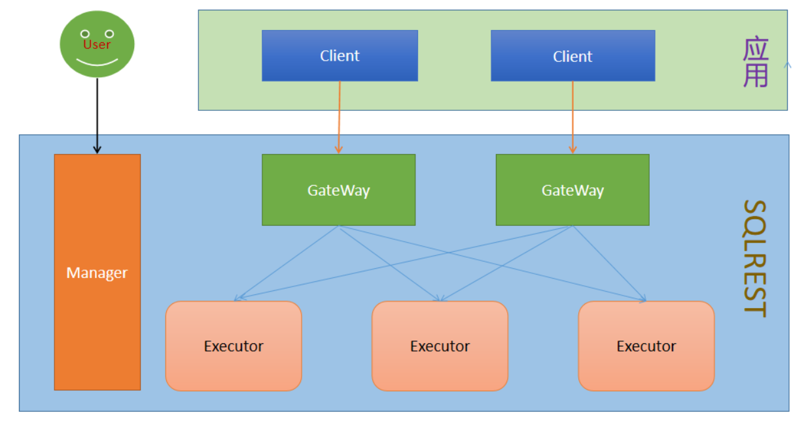
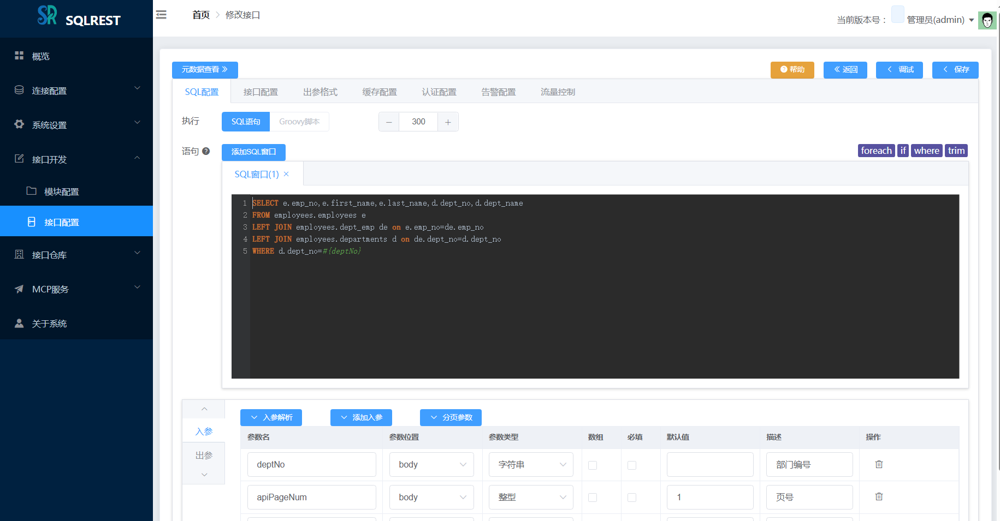
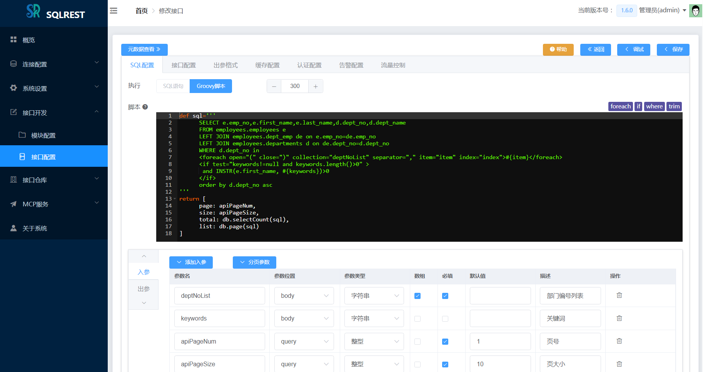
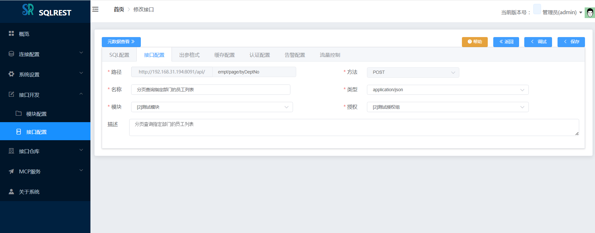
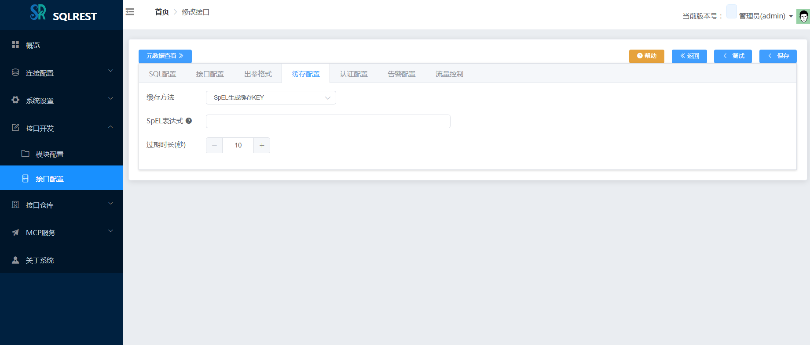
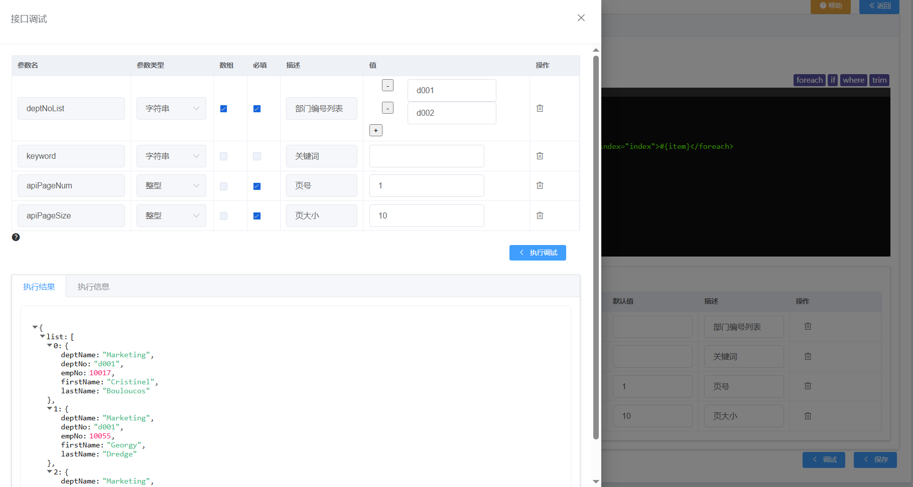
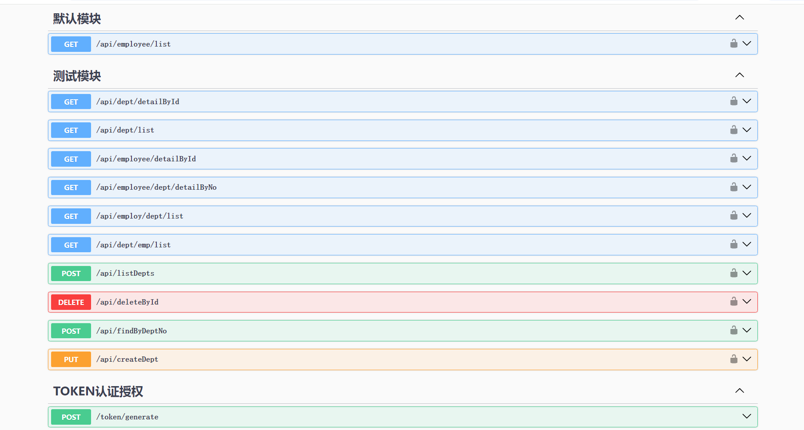
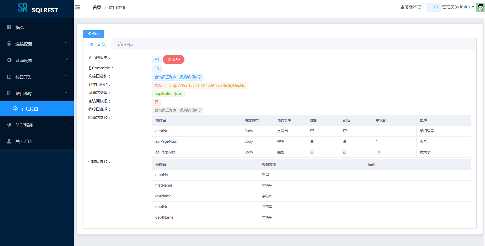
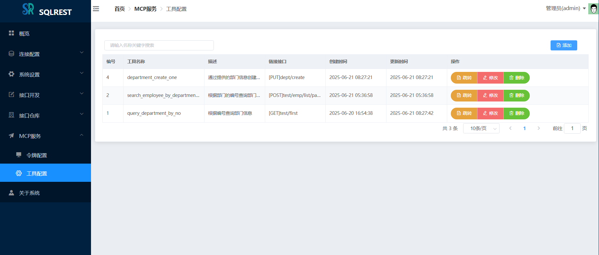
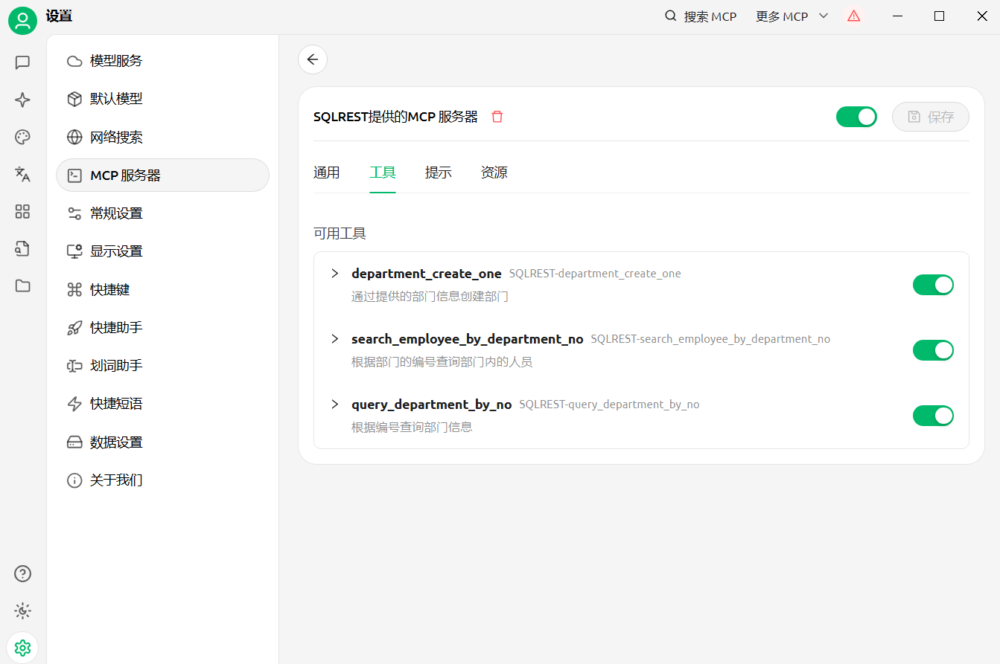

> A convenient tool for converting SQL operations into RESTful APIs

## 1. Introduction

SQLREST is an open-source project designed to provide a simple and powerful way to convert SQL operations into RESTful APIs. It supports multiple databases and allows users to create APIs by configuring SQL statements without writing complex backend logic. Users only need to select a data source, input SQL or scripts, and configure a simple path to quickly generate API interfaces.

### 1. Features

SQLREST features include:

- **Direct SQL-to-API Building**: Generate RESTful APIs by configuring CRUD SQL and parameters.
- **Multi-Database Support**: Supports 20+ common databases, including several domestic databases.
- **MyBatis Syntax Support**: Supports MyBatis dynamic SQL syntax.
- **Groovy Script Support**: Supports Groovy syntax for building complex interface logic.
- **Parameter Type Support**: Supports multiple types including integer/floating-point/time/date/boolean/string/object.
- **ContentType Support**: Supports multiple input request formats including application/x-www-form-urlencoded and application/json.
- **Authentication Support**: Provides Token-based authentication mechanism to protect API security.
- **Online API Documentation**: Supports automatic generation of online API documentation such as Swagger and Knife4j.
- **Cache Configuration Support**: Supports Hazelcast or Redis caching to improve API access performance.
- **Flow Control Management**: Supports traffic control through Sentinel to prevent system overload.
- **Unified Alarm Integration**: Supports integration and triggering of unified alarm systems.
- **API Version Management**: Supports API version control management.
- **Batch Import/Export**: Supports batch import/export of interfaces.
- **LLM MCP Service**: Supports creating MCP tools with simple configuration.

As a data access middleware in microservice architecture, SQLREST is suitable for the following scenarios:

- **Quickly convert SQL to API**
- **Suitable for data platforms, BI tools, low-code platforms, etc.**

### 2. Supported Databases

Currently supported databases include:

- Oracle (by Oracle Corporation)
- Microsoft SQL Server (2005+)
- MySQL
- MariaDB
- PostgreSQL/Greenplum
- DB2 (by IBM)
- Sybase Database
- DM Database (Domestic - Dameng)
- Kingbase8 Database (Domestic - Renmin University)
- HighGo Database (Domestic)
- Oscar Database (Domestic - Shentong)
- GBase8a Database (Domestic - Nanda General)
- Apache Hive
- Cloudera Impala
- SQLite3
- OpenGauss
- ClickHouse
- Apache Doris
- StarRocks
- OceanBase
- TDengine

### 3. Module Structure



```
└── sqlrest
    ├── sqlrest-common           // Common definitions module
    ├── sqlrest-mcp              // MCP protocol module
    ├── sqlrest-template         // SQL content template module
    ├── sqlrest-cache            // Executor cache module
    ├── sqlrest-persistence      // Database persistence module
    ├── sqlrest-core             // Core API implementation module
    ├── sqlrest-gateway          // Gateway node
    ├── sqlrest-executor         // Executor node
    ├── sqlrest-manager          // Manager node
    ├── sqlrest-manager-ui       // Web interaction interface
    ├── sqlrest-dist             // Project packaging module
```

### 4. Planned Features

- **API Details Feature**: Support detailed definition of interfaces, data sources, access analysis, etc.
- **Enhanced Syntax Hints**: Based on implemented database and table name hints, provide enhanced intelligent hints based on database metadata to improve user experience.

## 2. Build and Package

This tool is developed purely in Java, and all dependencies come from open-source projects. The SQLREST project uses Maven for building.

### 1. Build and Package

- **Requirements**:

  **JDK**: >=1.8 (JDK 1.8 is recommended)

  **Maven**: >=3.6
> The default Maven repository is located abroad, which may be slow in China. You can switch to Alibaba Cloud's repository.
>  
> Reference tutorial: [Configure Alibaba Cloud Repository](https://www.runoob.com/maven/maven-repositories.html)

- **Build commands**:

**(1) On Windows:**

```
Double-click the build.cmd script file to build and package
```

**(2) On Linux/MacOS:**

```
git clone https://gitee.com/inrgihc/sqlrest.git
cd sqlrest/
sh ./build.sh
```

**(3) In Docker:**

```
git clone https://gitee.com/inrgihc/sqlrest.git
cd sqlrest/
sh ./docker-maven-build.sh
```

### 2. Installation and Deployment

(1) After the build is complete, a package file `sqlrest-relase-x.x.x.tar.gz` will be generated in the `sqlrest/target/` directory. Copy the file to the deployment machine with JRE installed and extract it.

(2) One-click installation based on docker-compose for Linux network environments. For x86 CentOS systems, the installation command is:

```
curl -k -sSL https://gitee.com/inrgihc/sqlrest/attach_files/2241027/download -o /tmp/sr.sh && systemctl stop firewalld && bash /tmp/sr.sh && rm -f /tmp/sr.sh
```

See documentation: [build-docker/install/README.md](build-docker/install)

(3) Physical Machine Deployment

- **Step 1**: Prepare a MySQL 5.7+ or PostgreSQL 11+ database

> When using MySQL database, configure `DB_TYPE=mysql` in config.ini and configure parameters with `MYSQLDB_` prefix;
> 
> When using PostgreSQL database, configure `DB_TYPE=postgres` in config.ini and configure parameters with `PGDB_` prefix

- **Step 2**: Modify the `sqlrest-relase-x.x.x/conf/config.ini` configuration file

```
# Manager node host address. If gateway and executor nodes
# are not on the same machine as manager, configure the manager node IP address
MANAGER_HOST=localhost


# Manager port
MANAGER_PORT=8090

# Executor port
EXECUTOR_PORT=8092

# Gateway port
GATEWAY_PORT=8091


# Database type: mysql or postgres
DB_TYPE=mysql

# MySQL host address
MYSQLDB_HOST=192.168.31.57
# MySQL port
MYSQLDB_PORT=3306
# MySQL database name
MYSQLDB_NAME=sqlrest
# MySQL username
MYSQLDB_USERNAME=root
# MySQL password
MYSQLDB_PASSWORD=123456

# PostgreSQL host address
PGDB_HOST=192.168.31.57
# PostgreSQL port
PGDB_PORT=5432
# PostgreSQL database name
PGDB_NAME=sqlrest
# PostgreSQL username
PGDB_USERNAME=postgres
# PostgreSQL password
PGDB_PASSWORD=123456


# JSON serialization timezone setting
JSON_TIMEZONE=Asia/Shanghai

# Whether to encrypt storage of data source account passwords
SQLREST_DS_ENCRYPT=false

# External configuration of gateway/manager URLs, empty by default
# SQLREST_MANAGER_URL=http://www.example.com:8090
# SQLREST_GATEWAY_URL=http://www.example.com:8091
```

>SQLREST cache supports distributed Hazelcast or Redis. In the application.yml configuration files under conf/{manager,gateway,executor}/ directories, you can configure Redis cache as follows. By default, Hazelcast cache is used (Note: cache configurations for manager/gateway/executor must be consistent).

```
sqlrest:
  cache:
    hazelcast:
      # Whether to enable Hazelcast cache
      enabled: false
    redis:
      # Whether to enable Redis cache. When enabled, configure the corresponding Redis information below
      enabled: true
      # In sentinel mode, do not configure host
      host: 127.0.0.1
      # In sentinel mode, do not configure port
      port: 6379
      password: 123456
      database: 0
      pool:
        min-idle: 1
        max-idle: 8
        max-active: 8
        max-wait: -1
        time-between-eviction-runs: -1
      # In non-sentinel mode, delete the entire sentinel node
      sentinel:
        # In sentinel mode, configure master
        master: mymaster
        # In sentinel mode, configure nodes
        nodes: 127.0.0.1:26379,127.0.0.1:26380,127.0.0.1:26381
```

- **Step 3**: If deploying on multiple host nodes, distribute `sqlrest-release-x.x.x` to other host nodes. If deploying on a single machine (single node), you can skip this step.

- **Step 4**: Start services

> On Windows, double-click the scripts in the following order to start the corresponding services:

Start manager service: `bin/manager_startup.cmd`

Start executor service: `bin/executor_startup.cmd`

Start gateway service: `bin/gateway_startup.cmd`

> On Linux/MacOS, execute the scripts in the following order to start the corresponding services:

Start manager service: `sh bin/sqlrestctl.sh start manager`

Start executor service: `sh bin/sqlrestctl.sh start executor`

Start gateway service: `sh bin/sqlrestctl.sh start gateway`

### 3. System Access

After startup, access the system at `http://<MANAGER_HOST>:<MANAGER_PORT>`.

Login username: ```admin```  Login password: ```123456```

## 3. User Guide

### 1. Documentation

[《SQLREST User Manual》](https://www.yuque.com/sanpang-jq7te/nys82g/hur636mthgyhaodb)

### 2. System Screenshots



















## 4. Contributing

To enable better sustainable development of the project, SQLREST hopes to attract more code development enthusiasts to participate in code contributions, including but not limited to:

- Improve frontend UI/UX
- Fix bugs and performance optimization
- Add new usability features

Contribution documentation reference: [Contribution Guide](https://gitee.com/inrgihc/dbswitch/blob/master/CONTRIBUTE.md)

## 5. Recommended Projects

[Database Migration and Sync Tool - dbswitch](https://gitee.com/inrgihc/dbswitch)

## 6. Community Recommendation

<div>
	<a href="https://dromara.org.cn/zh/projects/" target="_blank">
        
    </a>
</div>

## 7. Feedback

If you have seen and used this tool, or if you think this tool is valuable to you, please give this project a **star** to show your support, thank you! If you encounter any bugs during use, please feel free to report them in issues. You can also scan the QR code below to join the discussion group (when adding as friend, please note: "SQLREST Discussion"):


